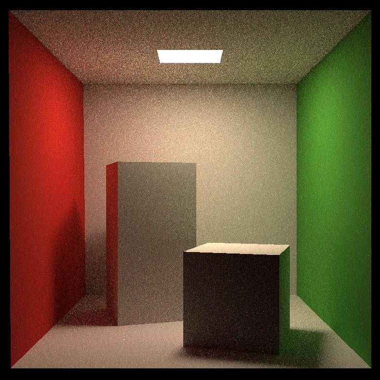
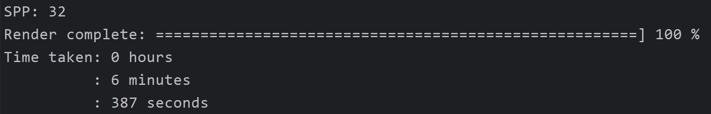
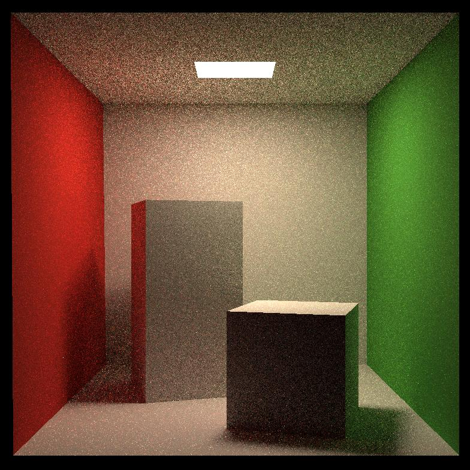
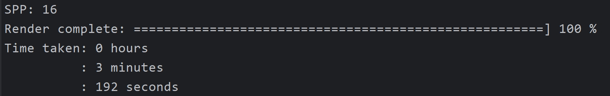
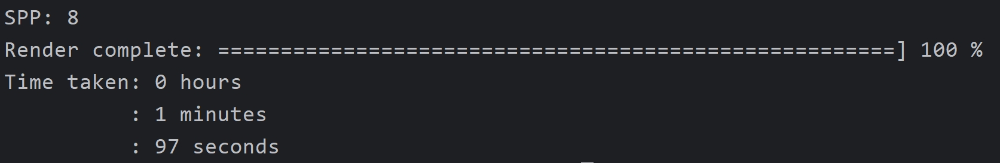

# ComputerGraphics
## RayTracing


1. #### **Result**

   ##### spp32  and 784 *784

   

   ##### spp16  and 784 *784

   

   ##### spp8   and 784 *784

   

   

2. **Path Tracing**

   ```c++
   // Implementation of Path Tracing
   Vector3f Scene::castRay(const Ray &ray, int depth) const {
       // TODO Implement Path Tracing Algorithm here
       Intersection inter = bvh->Intersect(ray);
       /** 1. If ray hit nothing , return black **/
       if (!inter.happened) {
           return Vector3f(0.0f);
       }
       /** 2. If ray hit light , return emission **/
       if (inter.m->hasEmission()) {
           return inter.m->getEmission();
       }
       /** 3. If ray hit other object , shade (p , wo) **/
       Vector3f L_dir(0.0f), L_indir(0.0f);
       Vector3f p = inter.coords;
       Vector3f wo = normalize(ray.direction); // 物体指向场景
       Vector3f N = inter.normal.normalized();
       /** direct lighting **/
       float pdf_light = 0.0f;
       Intersection inter_light;
       // sampleLight (inter , pdf_light)
       sampleLight(inter_light, pdf_light);
       // Get x , ws , N , emit from inter
       Vector3f x = inter_light.coords;
       Vector3f ws = (x - p).normalized();  // p -> x
       Vector3f NN = inter_light.normal.normalized();
       Vector3f emit = inter_light.emit;
       // Shoot a ray from p to x
       Ray ray_p2x(p, ws);
       Intersection inter_p2x = bvh->Intersect(ray_p2x);
       // If the ray is not blocked in the middle
       if (inter_p2x.happened && inter_p2x.obj->hasEmit()) {
   //    if ((intersect(Ray(p, ws)).coords - x).norm() < 0.01) {
           // L_dir = emit * eval (wo , ws , N) * dot (ws , N) * dot (ws, N) / | x-p |^2 / pdf_light
           L_dir = emit * inter.m->eval(wo, ws, N) * dotProduct(ws, N) * dotProduct(-ws, NN) / (x - p).norm() /
                   (x - p).norm() / pdf_light;
           // 前两个ws都是指初始射线的出射方向，最后一个ws是光源处的入射方向。光源处的ws是指向光源的，计算时需要反向，不然计算出来的数值是负数，并导致渲染结果一片漆黑。
       }
       /** indirect lighting **/
       // Test Russian Roulette with probability RussianRoulette
       float ksi = get_random_float();
       if (ksi < RussianRoulette) {
           // wi = sample (wo , N)
           Vector3f wi = inter.m->sample(wo, N).normalized();
           // Trace a ray r(p , wi)
           Ray ray_p2wi(p, wi);
           Intersection inter_p2wi = bvh->Intersect(ray_p2wi);
           // If ray r hit a non-emitting object at q
           if (inter_p2wi.happened && !inter_p2wi.obj->hasEmit()) {
               // L_indir = shade (q , wi) * eval (wo , wi , N) * dot (wi , N) / pdf (wo , wi , N) / RussianRoulette
               L_indir = castRay(ray_p2wi, depth) * inter.m->eval(wo, wi, N) * dotProduct(wi, N) /
                         inter.m->pdf(wo, wi, N) / RussianRoulette;
           }
       }
       return L_dir + L_indir;
   }
   ```

3. #### Moller-Trumbore算法

   ```c++
   inline Intersection Triangle::getIntersection(Ray ray)
   {
       Intersection inter;
   
       // TODO
       if (dotProduct(ray.direction, normal) > 0) // back face culling    ray -->> back to front
           return inter;
       double u, v, t_tmp = 0;
       Vector3f pvec = crossProduct(ray.direction, e2); // pvec = d x e2  -->> s1
       double det = dotProduct(e1, pvec);  // det = e1 * s1
       if (fabs(det) < EPSILON)
           return inter;
   
       double det_inv = 1. / det;
       Vector3f tvec = ray.origin - v0; // tvec = o - p0  -->> s
       u = dotProduct(tvec, pvec) * det_inv; // s * s1 / det   -->> b1
       if (u < 0 || u > 1)
           return inter;
       Vector3f qvec = crossProduct(tvec, e1);  // qvec = s x e1 -->> s2
       v = dotProduct(ray.direction, qvec) * det_inv;  // d * s2 / det   -->> b2
       if (v < 0 || u + v > 1)
           return inter;
       t_tmp = dotProduct(e2, qvec) * det_inv;
   
       // TODO find ray triangle intersection
       // if ray intersects triangle, store intersection information in inter
       if (t_tmp > ray.t_min && t_tmp < ray.t_max) { // t_tmp is in the range of ray
           inter.coords = ray(t_tmp); // define:  Vector3f operator()(double t) const{return origin+direction*t;}
           inter.distance = t_tmp;
           inter.happened = true; // has intersection
           inter.normal = normal;
           inter.obj = (Object *) this;
           inter.m = m;
       }
       return inter;
   }
   ```

4. #### BVH

   ```c++
   // 光线与场景求交
   Intersection BVHAccel::getIntersection(BVHBuildNode* node, const Ray& ray) const
   {
       // TODO Traverse the BVH to find intersection
       Intersection inter;
       std::array<int, 3>dirIsNeg = { int(ray.direction.x<0), int(ray.direction.y<0), int(ray.direction.z<0) };
       // no intersection
       if (!node->bounds.IntersectP(ray, ray.direction_inv, dirIsNeg)) { // check if ray intersect with the node
           return inter;
       }
       // no child node
       if (node->left == nullptr && node->right == nullptr) {
           inter = node->object->getIntersection(ray);
           return inter;
       }
       // child node
       Intersection left, right;
       left = getIntersection(node->left, ray);
       right = getIntersection(node->right, ray);
       return left.distance < right.distance ? left : right;
   }
   ```

   ```C++
   // 光线与包围盒求交函数
   inline bool Bounds3::IntersectP(const Ray& ray, const Vector3f& invDir,
                                   const std::array<int, 3>& dirIsNeg) const
   {
       // invDir: ray direction(x,y,z), invDir=(1.0/x,1.0/y,1.0/z), use this because Multiply is faster that Division
       // dirIsNeg: ray direction(x,y,z), dirIsNeg=[int(x>0),int(y>0),int(z>0)], use this to simplify your logic
       // TODO test if ray bound intersects
       Vector3f tmin = (pMin - ray.origin) * invDir;
       Vector3f tmax = (pMax - ray.origin) * invDir;
       if (dirIsNeg[0])
           std::swap(tmin.x, tmax.x);
       if (dirIsNeg[1])
           std::swap(tmin.y, tmax.y);
       if (dirIsNeg[2])
           std::swap(tmin.z, tmax.z);
       float texit = std::min(tmax.x, std::min(tmax.y, tmax.z));
       float tenter = std::max(tmin.x, std::max(tmin.y, tmin.z));
       return tenter <= texit && texit >= 0;
   
   }
   ```

5. #### OMP 加速

   ```c++
   #pragma omp parallel for default(none) shared(height, width, framebuffer, scale, imageAspectRatio, eye_pos, scene, spp, m)
       for (uint32_t j = 0; j < height; ++j) {
           for (uint32_t i = 0; i < width; ++i) {
               // generate primary ray direction
               float x = (2 * (i + 0.5) / (float)scene.width - 1) *
                         imageAspectRatio * scale;
               float y = (1 - 2 * (j + 0.5) / (float)scene.height) * scale;
   
               Vector3f dir = normalize(Vector3f(-x, y, 1));
               for (int k = 0; k < spp; k++) {
   //                framebuffer[m] += scene.castRay(Ray(eye_pos, dir), 0) / spp;
                   framebuffer[j * scene.width + i] += scene.castRay(Ray(eye_pos, dir), 0) / spp;
               }
   //            m++;
           }
   
   #pragma omp critical
           {
               m++;
               UpdateProgress(m / (float) scene.height);
           }
       }
       UpdateProgress(1.f);
   ```